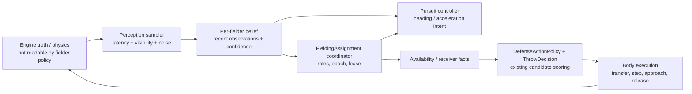

# Fielding AI: perceptual pursuit and multi-agent decision research

Date: 2026-08-10
Scope: Issue #26 only — fielder observation, pursuit, assignment, and defense decisions.
Gameplay source audited: `agent/b0805-29-possession-footwork@60b993b73fed854934a976e45e8feb9437deb584`, `baseball3d.html`.
Status: research/design only. This report does **not** change `baseball3d.html`, prescribe a merge, or claim that any proposed validation has run.

## 1. Executive verdict

Adopt a **two-rate, observation-gated hybrid**: a short, coarse initial flight estimate is permitted for an opening role assignment; after that, each fielder steers from delayed, sampled visual observations and a local belief state, while a team assignment coordinator reallocates *roles* atomically at a slower decision tick. Do not let the controller call `stepBall()` forward on the exact hidden ball state or retain an exact `plan.x/y` as a durable truth.

This is a modification of H2, not a claim that one historical perception theory has settled every baseball trajectory. LOT, OAC, affordance/current-future control, and newer predictive work disagree in important experiments. They jointly support a controller that continually revises from the unfolding trajectory and respects the player's movement limits; they do **not** support a permanent, omniscient landing point.

Keep H4. The existing separation between `FieldingAssignment`/`ReachModel`, `ThrowDecision`/`DefenseActionPolicy`, and possession/body execution is the right direction. Confirm H5 with a narrow boundary: ML/RL may generate adversarial scenarios, tune or compare an explainable controller offline, and learn imitation references; it must not become the uninspectable runtime defense policy in v1.

## 2. Scope, evidence boundaries, and non-claims

- The current gameplay authority is b29 at `60b993b73fed854934a976e45e8feb9437deb584`, not a claimed b27 implementation. The b29 possession-footwork fix remains required.
- Source code was read at the paths and functions named below. Paper findings are design evidence, not a license to copy paper text, figures, or data.
- No raw dataset was downloaded. In particular, no OpenBiomechanics archive was downloaded; it is outside this fielding-AI scope and the handoff requires advance size/count/license reporting before a large raw download.
- The cited human studies use controlled catching or virtual-reality tasks. They do not prove an exact numerical reaction delay, animation, or catch rate for this game. Those values require game-side calibration.
- Historical b23/b26/b28/b29 validation claims in the handoff are recorded as existing context only. This research run did not rerun the 138-recording corpus, 1000-route run, 50-game run, browser suite, or owner playtest.

## 3. Primary-source inventory

| Source actually read | Exact material / algorithm flow | Maintenance / license | Relevance and evidence limit |
|---|---|---|---|
| McBeath, Shaffer & Kaiser, *How baseball outfielders determine where to run to catch fly balls*, Science 268 (1995), 569–573, [DOI 10.1126/science.7725104](https://pubmed.ncbi.nlm.nih.gov/7725104/) | The NLM record and abstract state the LOT proposal: choose a running path that keeps the ball's relative optical movement on a linear optical trajectory, transforming the temporal catch problem into a spatial control problem. | Copyrighted journal article; no reusable game code. Publisher full text was not used. | Evidence for online visual control and curved routes. It is not proof that LOT alone handles all trajectories. |
| Dienes & McLeod, *How to catch a cricket ball*, Perception 22 (1993), 1427–1439, [DOI 10.1068/p221427](https://pubmed.ncbi.nlm.nih.gov/8090620/) | The abstract gives the OAC condition: steer so `d²(tan α)/dt² = 0`, where `α` is gaze elevation; this generally yields interception before ground contact. | Copyrighted journal article; no reusable code. | Gives a concrete optical error signal, but does not supply baseball-game role coordination or a catch/throw state machine. |
| Fink, Foo & Warren, *Catching fly balls in virtual reality: a critical test of the outfielder problem*, Journal of Vision 9(13):14 (2009), [PMCID PMC3816735](https://pmc.ncbi.nlm.nih.gov/articles/PMC3816735/) / [DOI 10.1167/9.13.14](https://doi.org/10.1167/9.13.14) | Read the indexed full-text methods/results: experienced players caught normal and apex-perturbed virtual flies while moving; the perturbation changed vertical optical acceleration without changing lateral optical motion. The reported result supported OAC and conflicted with both a pure LOT account and fixed trajectory prediction. | Research article; use concepts, not prose/figures without checking article-specific terms. | Strong reason not to freeze a predicted landing point. Its perturbation does not prove an exact runtime update frequency. |
| Sugar, McBeath & Wang, *A unified fielder theory for interception of moving objects either above or below the horizon*, Psychonomic Bulletin & Review 13 (2006), 908–917, [DOI 10.3758/BF03194018](https://experts.azregents.edu/en/publications/a-unified-fielder-theory-for-interception-of-moving-objects-eithe/) | Read the abstract: the proposed common invariants are constant optical speed in the vertical image plane and constant optical direction in a perpendicular image plane; the reported fits cover both airborne balls and grounders. | Copyrighted article; no reusable game code. | Useful unifying hypothesis, but it should not erase different game controllers for grounders, line drives, and flies. |
| Postma & Zaal, *A unified account of current-future control and affordance-based control for running to catch fly balls*, Journal of Vision 25(11):9 (2025), [PMCID PMC12448125](https://pmc.ncbi.nlm.nih.gov/articles/PMC12448125/) / [DOI 10.1167/jov.25.11.9](https://doi.org/10.1167/jov.25.11.9) | Read abstract, Equation 1/9 discussion, and simulation discussion. It combines OAC-derived ideal acceleration with maximum available acceleration. A ball is catchable when the ideal/max-acceleration ratio stays within `[-1, 1]`; error-nulling then guides movement within that action boundary. | CC BY-NC-ND 4.0 for the article. No game code; no adapted figures/text. | Best source for explicitly separating visual guidance from whether *this fielder* can make the play. It is a simulation contribution, not a deployed baseball AI. |
| Aguado & López-Moliner, *The predictive outfielder: a critical test across gravities*, Royal Society Open Science 12:241291 (2025), [PMCID PMC11836427](https://pmc.ncbi.nlm.nih.gov/articles/PMC11836427/) / [DOI 10.1098/rsos.241291](https://doi.org/10.1098/rsos.241291) | Read abstract/results summary and the article's described GOAC/predictive comparisons. Its model continuously updates landing position and remaining flight time from optic variables and real-time movement, explicitly incorporating gravity; experimental path/timing evidence favored that environmental-constant-aware model under gravity manipulations. | CC BY 4.0 article. Supplementary R/data are separate and were not downloaded or assumed licensed for game use. | Important counterweight to “pure optical only.” It supports a continuously revised belief, not initial exact physics as permanent ground truth. |
| [google-research/football](https://github.com/google-research/football), inspected at default `master` latest commit `3d9e754720a95621bba6475c4d3b0d56fe919014` (2025-06-17) | `gfootball/env/football_env.py`: `FootballEnv._construct_players()` makes player instances and `step()` translates actions, steps the core, invalidates observation cache, then returns per-player observations. `gfootball/doc/observation.md`: raw state documents ball position/direction/rotation/ownership, team positions/directions, active player, game mode, and one observation per controlled player. `gfootball/env/wrappers.py`: `Simple115StateWrapper.convert_observation()` flattens positions/directions/ball state/owner/active/mode; `SMMWrapper.observation()` creates a spatial map. `gfootball/env/scenario_builder.py`: `Scenario` imports a scenario, lets it build positions/roles, then seeds a deterministic or stochastic episode; `11_vs_11_easy_stochastic.py::build_scenario()` defines the field arrangement. | Apache-2.0 (`LICENSE`). Not archived; latest default-branch commit recorded above, so maintenance is limited compared with actively changing ML-Agents. | Reuse the *explicit observation/action contract, scenario seed, and replay discipline*, not its soccer state or its globally precise raw observation. |
| [Unity-Technologies/ml-agents](https://github.com/Unity-Technologies/ml-agents), inspected at default `develop` latest commit `ab179e18df7197d644f08637d8acf1fc4a1d5014` (2026-07-29) | `com.unity.ml-agents/Runtime/Agent.cs::RequestDecision()` sets a decision request then requests an action; `RequestAction()` repeats the prior action without a new decision. `DecisionRequester.cs::MakeRequests()` schedules them by `DecisionPeriod`/`DecisionStep`. `ml-agents/mlagents/trainers/environment_parameter_manager.py::EnvironmentParameterManager.get_current_samplers()` selects the sampler for the active curriculum lesson. | Apache-2.0 (`LICENSE.md`), active repository. It is Unity/C#/Python infrastructure, not browser-game runtime code. | Adopt the distinction between frequent motor action and less-frequent decisions, plus seeded scenario/curriculum use offline. Do not import its runtime into this single-file WebGL game. |
| [Kentops/Baseball-Game](https://github.com/Kentops/Baseball-Game), inspected at default `main` latest commit `97e330e876b36a497aef61a21aaccc727402a1d5` (2026-08-08) | `Assets/Scripts/Managers/FielderTargetManager.cs::fielderTargets()` waits 1 s, picks the closest fielder to `flyBallLanding` or current ball position, writes mutable `pursueTarget` values, and repeats every 0.5 s. `Assets/Scripts/Base-Player Scripts/Fielder.cs::trackBall()` sends a NavMesh agent directly to `flyBallLanding` before first ground contact, otherwise current ball; `HoldingBall()`/`throwBall()` mix possession, manual input, motion, and throwing. `BaseBall.cs::hold()` turns an ungrounded ball into a fly out immediately; `onThrow()` changes the ball state. | The root has no `LICENSE`/`COPYING`/`NOTICE` file and GitHub reports no license. Recent commit does not establish production quality. | A negative comparison: it exhibits the omniscient landing-point, nearest-only, polling, and mixed-state patterns this redesign must avoid. No reuse. |

### Source conflict, not forced consensus

1. The 1995 LOT result is evidence for optical-trajectory maintenance.
2. The 2009 VR perturbation favors OAC over pure LOT and fixed target prediction.
3. The 2025 Postma/Zaal model adds a fielder-specific action boundary to OAC-like control.
4. The 2025 Aguado/López-Moliner work says environmental constants such as gravity can improve continuously updated prediction.

Therefore v1 must be calibrated as a game controller, not announced as a literal reproduction of a single human theory. The safe common denominator is: current sensory samples + recent history + player-specific movement limits + continuous correction, with no durable exact future state.

## 4. Current b29 code actually read

All line references in this section are `baseball3d.html` at `60b993b73fed854934a976e45e8feb9437deb584`.

| Current system | Exact code read | What it does now | Fielding-AI implication |
|---|---|---|---|
| Shared movement model | `A.speed` / `FIELD_SP` / `runTime` (lines 863–945); `reachTimeToPoint` (947–984); `reactOf` (1365–1367) | `ReachModel` consistently includes reaction, acceleration, current velocity, and turn cost. | Preserve it as the physical/action-capability oracle. It must consume a requested point from an observation-based belief, not mint a hidden future point. |
| Initial plan | `planPlay` (1368–1430) | Simulates `stepBall()` up to 7 s from the full ball state, creates catch-height candidates, evaluates every fielder, and returns `f/t/x/y/air/firstLand`. | This is an omniscient offline-style planner. Retain only as an **offline validator** or a clearly limited opening estimate; do not keep `firstLand`/exact `x,y` as runtime policy truth. |
| Pursuit replan | `interceptPoint` (1274–1308); target gate functions (1571–1599) | Forward-simulates a full ball copy for up to 900 physics steps to find a reachable point. `shouldAdoptFieldingTarget` adds a 0.12 s gain threshold or old-target-passed condition. | The gate reduces thrash but cannot cure future-information leakage because both old/new targets derive from perfect future physics. Replace source of the candidate, retain a measurable hysteresis/commitment mechanism. |
| Ownership / cover | `markFieldRole` through `setPrimaryFielder` (1600–1642); `assignCoverRole`, `releaseCoverForTemporaryRole` (1617–1666) | One primary plus mutable base-cover roles, with `roleSeq` diagnostics. | Strong base to preserve. Add role epoch, lease, explicit backup/cutoff/relay roles, and atomic assignment replacement. |
| Opening role allocation | `startFlight` (3233–3277) | Calls `planPlay`, writes `ball.pred`, assigns primary, then uses a fixed positional preference list for 1B/2B/3B/home cover and pushes unassigned fielders 25% toward plan direction. | The allocation should become a constrained role assignment over current belief/ability, not positional special cases or `ball.pred`. |
| Flight update / handoff | `stepFlight` (3395–3689), particularly retarget 3419–3433 and rolling handoff 3438–3476 | Every 0.2 s calls `interceptPoint`; every 0.35 s may rerun `planPlay(ball,true)` after a passed/away-from-primary condition. Wall/deflect paths call `planPlay` again. | Fixes individual historical failures, but scattered timing gates and exact resimulation create a stale/oscillation surface. Use a single decision schedule and an event-driven trajectory epoch on bounce/wall/deflect. |
| Throw decision | `selectDefenseAction` (1904–1908); `visibleRunnerThreat` (1912–1926); `chooseThrowTarget` (1989–2007); `decideThrowTarget` (2011–2035); `doublePlayContinuation` (1942–1964) | Candidate throw actions use observed runner direction rather than runner goal, then score ETA, success, base value, and double-play continuation. | Preserve. The pursuit/assignment layer provides availability and receiver/cutoff candidates; it must not reintroduce `goal`, `autoGoal`, or exact future runner intent. |
| Possession execution boundary | `beginThrowPhase` (2160–2217); `prepareThrowerFootwork` (2240–2249); `updateThrowPhase` ordering (2251–2300) | Transfer retains its distinct timing context, erases stale movement target, zeroes pursuit velocity, faces the throw target before `moveFielders`. | Preserve exactly as a separate body-execution rule. A new pursuit controller must become inactive on possession; it must not overwrite `transfer`, `step`, or `approach`. |

### Current evidence of future information and duplicated control

The current code deliberately shares physics between rendered ball and planning, which avoids a visual/physical mismatch. It nevertheless gives the fielder a privilege a human does not have: `planPlay`/`interceptPoint` copy exact `x,y,z,vx,vy,vz,bs,ss` and advance hidden future physics. The result also persists as `ball.pred`, `ball.planT`, and fielder target coordinates.

That is different from using the same physics in an **offline test oracle**. The engine may know future state for rules, rendering, replay, and test scoring; a runtime fielder policy may not read it. This distinction is the core anti-leak boundary.

## 5. Finding-to-current-code mapping

| Research finding | Map to current system | Recommendation |
|---|---|---|
| Catching is continuously guided; pure LOT and pure landing-point accounts conflict with later perturbation evidence. | `planPlay`, `interceptPoint`, `ball.pred`, and 0.2 s exact replans. | Initial belief may be coarse; route corrections must consume sampled observation history, never `stepBall(copy)` in the policy. |
| Catchability depends on player action limits, not ball optics alone. | `ReachModel` already holds speed, acceleration, turn, current motion, and reaction. | Compute an observation-derived catchability/confidence envelope against those limits. Do not turn `f.fld` into an all-purpose speed multiplier. |
| Gravity/environment can inform an updated prediction. | Current `stepBall` knows gravity/drag/spin perfectly. | Allow a calibrated **belief filter** to use known game constants and measured observations; bind it to noisy/delayed samples and re-estimate, not exact hidden spin/future path. |
| Multi-agent simulation benefits from explicit, per-agent observations, action timing, seeded scenarios, and replayable steps. | Roles are mutable fields on each fielder; different replanning gates update them. | Introduce a canonical `FieldingPerceptionFrame`, `FieldingAssignment` epoch, action intents, and scenario seed/trace fields. |
| Decision frequency need not equal movement frequency. | `stepFlight` physics uses 1/240 s while target/role gates occur ad hoc at 0.20/0.35 s. | Motor integration stays each physics frame; perception sample at 60 Hz; primary controller at 60 Hz; team role decision at 10 Hz plus discrete events. |
| Nearest-to-perfect-landing-point polling is a known bad pattern. | Kentops uses `flyBallLanding` and closest fielder; b29 is more advanced but still starts from exact future trajectory. | Reject direct landing-point authority and nearest-only ownership. Assign roles jointly, with commitments and an explicit handoff proof. |

## 6. `copy` / `adapt` / `concept-only` / `reject`

| Source / idea | Verdict | Why and concrete allowed use |
|---|---|---|
| McBeath 1995 LOT | concept-only | Paper, not code. Use as one measurable optical-error hypothesis in offline calibration; do not treat as settled universal control. |
| Dienes & McLeod OAC | concept-only | Use the elevation-error family to define a controller feature/diagnostic; calibrate against game routes. |
| Fink et al. VR perturbation | concept-only | Copy the *test shape* — alter the later trajectory while holding earlier samples fixed — for regression tests. Do not copy text/figures. |
| Sugar et al. unified fielder theory | concept-only | A reason to share observation plumbing across ground/air, while retaining class-specific controllers. |
| Postma & Zaal 2025 affordance/current-future | adapt | Implement the action-boundary idea as a belief-derived `catchability` score using `ReachModel`; do not reproduce its paper equations or figures blindly. CC BY-NC-ND makes direct derivative presentation unsuitable. |
| Aguado & López-Moliner 2025 predictive outfielder | adapt | Use continuously updated physical belief with environmental constants as a competing calibration controller. It remains a model to test, not permission to use future truth. |
| Google Research Football observation/action/scenario architecture | adapt | Apache-2.0 allows reuse subject to notices, but Python/Gym/C++ code does not fit single-file WebGL. Adapt explicit schema, per-agent observation, seeded scenario/replay, and wrapper-like test harness. |
| Unity ML-Agents decision/action cadence and curriculum manager | adapt | Apache-2.0 but Unity runtime is not an embedding target. Adapt `decision != action` cadence and offline seeded curriculum/randomization. |
| Kentops `FielderTargetManager` / `Fielder` | reject | No repository license, and code uses global exact `flyBallLanding`, nearest-only pursuit, polling, and mixed pursuit/possession/throw state. No copy or adaptation. |
| Runtime deep-RL controller for this game | reject for v1 | It would hide future-observation leakage and policy errors behind weights, make recordings difficult to diagnose, and conflict with the established utility-policy architecture. |

## 7. Target architecture

### 7.1 Responsibility boundaries



1. **Engine truth** remains available to rendering, rules, replay, and offline validation only.
2. **Perception sampler** is the sole bridge to runtime fielder policy. It records what a fielder can see at a timestamp and models reaction/visibility; it must not expose future samples.
3. **Fielder belief** is local and historical. It estimates class, bearing, elevation trend, lateral trend, confidence, and a reachable/catchable region — not an authoritative landing point.
4. **FieldingAssignment coordinator** makes team-level roles from belief snapshots and physical availability. It applies an atomic, versioned assignment with a short lease. It does not animate or throw.
5. **Pursuit controller** changes heading/acceleration every motor tick within its role, using its local belief. It has no write access to cover roles or throw choice.
6. **ThrowDecision / DefenseActionPolicy** remains the single policy scorer after possession. It can read physical current runner positions/directions and assignment availability, but not runner intentions or trajectory future.
7. **Body execution** owns catch/secure/transfer/throw state. `prepareThrowerFootwork` remains the protection against stale pursuit movement.

### 7.2 State, observation, and action contract

| Object | Allowed fields | Explicitly forbidden fields | Owner / cadence |
|---|---|---|---|
| `FieldingPerceptionFrame` | `sampleTime`, fielder eye/body pose, current visible ball bearing/elevation/angular size, finite-difference angular rates from prior samples, whether ball is occluded, visible current teammate positions/motion, visible current runner positions/direction, field/wall landmarks, play class evidence, own capability profile. | `ball.pred`, `plan.x/y`, `firstLand`, `planT`, any future `stepBall` result, exact raw ball velocity/spin as policy input, future bounce/wall event, future `canCatchAir`, runner `goal`, `autoGoal`, `safeGoal`, manual intent lock, future throw choice/ETA. | Per fielder, sample at 60 Hz after configurable sensory/reaction delay. |
| `FielderBelief` | Ring buffer of frames; smoothed bearing/elevation/lateral trend; class posterior `{fly, liner, ground}`; confidence; estimated catchability interval; recommended route/turn demand; uncertainty after a bounce/wall/deflect. | A globally exact landing coordinate labelled as truth; unbounded state copied from engine physics. | Per fielder, update from its own frame only. |
| `FieldingAssignment` | `epoch`, `role`, primary ID, backup ID, cover/cutoff/relay assignments, role target *intent*, confidence, expiry/lease, reason, diagnostic scores. | Multiple primaries; a fielder simultaneously holding incompatible primary/cover/cutoff roles; direct body velocity; a throw target. | Team coordinator at 10 Hz and on observed discrete events. Atomic commit only. |
| `PursuitIntent` | Desired heading, speed fraction, turn/plant request, target region or optical error, confidence, source epoch. | Possession state transition, cover reassignment, throw action, future-ball coordinate. | Per unpossessed moving fielder, 60 Hz. |
| `DefenseAvailability` | Current assignment epoch/role, current fielder position/velocity, current route confidence, cover arrival based on `ReachModel`. | Runner intent, hidden ball future, presentation/animation state as a decision shortcut. | Published to `DefenseActionPolicy` only at decision tick. |

**Audit rule:** a policy implementation receives `FieldingPerceptionFrame` plus its own persisted belief, never the global `ball` object. Type/module boundaries and tests must make an accidental `ball.pred` or `stepBall` import fail.

### 7.3 Role system

Use one assignment record with these mutually exclusive primary movement roles:

- `PRIMARY_PURSUE`: the only fielder authorized to initiate a batted-ball catch attempt.
- `BACKUP`: trails the likely miss/deflection corridor and becomes a candidate only after an assignment event.
- `COVER_BASE[1..4]`: occupies a base for an imminent legal play.
- `CUTOFF` / `RELAY`: receives or relays only when an assignment-aware throw candidate uses it.
- `RETURN` / `HOLD`: fall back to a legal position without chasing.
- `NONE`: no active movement assignment.

`PRIMARY_PURSUE` may be released only by one coordinator transaction that writes a new epoch, the replacement role, and a successor role for the old primary. This eliminates a half-frame where the old primary is neither pursuing nor useful, and prevents independent writes to `primary` and `coverBase`.

### 7.4 Handoff and retarget rules

1. **Opening allocation:** after a configurable reaction delay, score each fielder's *belief-derived* catchability, current `ReachModel` cost, role opportunity cost, and backup/cutoff requirement. Choose the role assignment jointly, rather than closest-first.
2. **Lease:** keep the primary assignment for at least 0.25 s except for an observed bounce/wall/deflect, possession, or a hard confidence collapse. This does not forbid smooth route steering inside the lease.
3. **Normal handoff:** evaluate at 10 Hz. Transfer only if the challenger improves expected catchability/arrival by a calibrated margin for two consecutive coordinator ticks (initial v1 proposal: 0.25 s or a materially higher catchability score), and the replacement is not abandoning an essential cover without a replacement.
4. **Event handoff:** observed wall hit, bounce, deflection, occlusion recovery, or confirmed primary miss increments a trajectory epoch. Mark prior ball belief stale and reassign after the ordinary perception delay; do not instantaneously use the engine's reflection state.
5. **No direct position authority:** a role target is an intent/region. A fielder's 60 Hz controller may steer within it from visual residuals; it may not overwrite the role record.
6. **Possession:** the new body state terminates any pursuit intent. The existing b29 `prepareThrowerFootwork()` remains the first movement operation in transfer.

## 8. Recommended pursuit algorithms

### 8.1 Common estimator

At each perception sample, keep the last 6–12 frames of ball bearing/elevation and fielder pose. Compute smoothed first/second differences and an uncertainty range. A known field coordinate system and calibrated gravity may be used *inside the estimator*, but its input is the delayed observation history, not true `vx/vy/vz/spin` or a future physics simulation.

The output is an interval such as “likely reachable corridor, confidence 0.64, estimated time window 1.1–1.4 s,” not “the ball will land exactly at `(x,y)`.” This lets the offline validator compare with truth without granting truth to the runtime player.

### 8.2 Outfield fly ball

1. At first reliable visual samples, estimate a broad intercept corridor and assign primary/backup jointly.
2. The primary steers lateral bearing toward the catch corridor and reduces the vertical optical residual. Use an OAC-like elevation-error feature (`d²(tan α)/dt²`) plus a bounded action-capability check; this is a controller family to calibrate, not an assertion that the literal paper equation ships unchanged.
3. The affordance check compares required lateral/longitudinal acceleration and turn demand with `ReachModel`/the fielder's limits. If not catchable, explicitly switch to `BACKUP`/wall-recovery/containment behavior rather than pretending the exact drop point was known all along.
4. Update motor intent at 60 Hz. Re-evaluate role ownership at 10 Hz only, subject to lease/hysteresis.
5. For a high-confidence routine fly, decelerate into a catch window; catch type and transfer recovery remain Agent C's state-machine responsibility.

### 8.3 Line drive

Use the same sensory/belief interface but a separate urgent controller:

- shorter initial reaction/candidate window and 60 Hz intent updates;
- prioritize current line-of-approach and reachable body volume over a long-range landing estimate;
- forbid a precomputed fly-ball target from surviving a liner-to-ground/bounce event;
- publish `catchability` and current body demand to the catch state machine, not a binary catch conclusion.

This preserves the existing physical-class separation: an airborne low liner remains a liner even if it becomes uncatchable. Do not infer batted-ball class from catch feasibility.

### 8.4 Ground ball

Ground balls use a low-horizon rolling estimator: observed current position, recent visible horizontal motion, surface/wall landmark evidence, and `ReachModel`. It may predict a short *corridor* for the next 0.25–0.40 s, but not run the exact future `stepBall` result to rest. Re-estimate each observation tick; a bounce/deflect/wall event starts a new trajectory epoch.

The primary's control objective is a playable approach region (front/side/backhand) supplied to the catch/footwork state machine, not merely the first reachable ball coordinate. This removes the need for both `interceptPoint()` and `planPlay()` to independently encode “comfortable point versus charge” branches.

### 8.5 Infield/outfield role allocation

- **Infield:** primary, force-base cover, and double-play receiver must be solved together from current roles, `ReachModel`, and current observed runner direction. The existing `doublePlayContinuation()` stays within action scoring. Do not select a primary first and hope a fixed name list later produces valid 2B/1B coverage.
- **Outfield:** primary, trailing backup, nearest practical cutoff, relay, and bases at risk are a single constrained assignment. The coordinator can give the throw policy multiple *available* receivers, but `DefenseActionPolicy` remains the only selector of a throw action.
- **Centralized versus distributed:** use a lightweight centralized coordinator for scarce, coupled roles; use distributed/local pursuit for body steering. Fully distributed ownership is inappropriate here because several players cannot independently choose the same ball or base. A monolithic centralized 60 Hz movement planner would re-create stale target and animation coupling.

## 9. One-frame / decision-tick pseudocode

```text
# PHYSICS FRAME, 1/240 s (or current engine cadence)
advance_authoritative_ball_and_rules()           # engine only; not an AI input
advance_body_execution_and_animation()           # possession/transfer owns its state

# PERCEPTION SAMPLE, 60 Hz, for each fielder that can see the ball
for fielder in fielders:
    frame = sample_visible_world_with_latency(fielder)
    # no ball.pred, no plan.x/y, no future stepBall(), no runner.goal
    belief[fielder] = update_belief(belief[fielder], frame)

    if fielder.possessionState in {transfer, step, approach, release}:
        cancel_pursuit_intent(fielder)
        continue
    if assignment.roleOf(fielder) == PRIMARY_PURSUE:
        pursuitIntent[fielder] = control_by_ball_class(
            belief[fielder], ownMotion[fielder], capability[fielder])
    elif assignment.roleOf(fielder) == BACKUP:
        pursuitIntent[fielder] = control_backup_corridor(belief[fielder])
    else:
        pursuitIntent[fielder] = control_assigned_role(assignment, fielder)

apply_movement_intents_once(pursuitIntent)       # no role writes here

# TEAM DECISION TICK, 10 Hz, plus observed bounce/wall/deflect/miss events
if role_tick_due() or observed_trajectory_epoch_changed():
    snapshot = collect_only_permitted_beliefs_and_current_capabilities()
    candidates = generate_joint_role_candidates(snapshot, ReachModel)
    proposal = choose_assignment_with_lease_and_hysteresis(candidates, assignment)
    if proposal.allowed:
        assignment = atomic_commit(proposal, epoch = assignment.epoch + 1)

# AFTER POSSESSION / AT THROW DECISION TICK
availability = availability_from_assignment_and_ReachModel(assignment)
throwCandidates = generate_candidates_from_visible_runner_direction(availability)
throwDecision = DefenseActionPolicy.select(throwCandidates)
body_execution_consumes(throwDecision)           # current b29 footwork gate remains first
```

## 10. Existing heuristics to delete or replace — only after v1 proves them redundant

| Current heuristic | Replacement | Do not delete until |
|---|---|---|
| `planPlay()` as runtime global oracle and `ball.pred` durable point (1368–1430; 3246–3249) | Offline truth oracle + bounded opening belief/role allocator. | Anti-leak and route/corpus tests pass. |
| `interceptPoint()` exact 900-step forward simulation (1274–1308) | Perception-history belief + class-specific controller. | Ground/line/fly replacement covers the existing catch/charge cases. |
| Separate “comfortable point”/charge choices duplicated in `planPlay` and `interceptPoint` | One ground/air controller that emits an approach region to Agent C. | Catch/footwork state machine has a stable input contract. |
| Scattered `planT`, `aimT`, `replanT` update gates (3419–3448) | Named perception cadence, role cadence, trajectory epoch, and assignment lease. | Existing rolling-handoff and wall-reflection fixtures pass. |
| Positional cover preference lists in `startFlight` (3261–3275) | Constrained role assignment with primary/backup/cover/cutoff/relay opportunity costs. | Coverage and double-play contracts demonstrate no missing receiver regression. |
| Target-coordinate hysteresis as the only anti-thrash guard (1572–1599) | Hysteresis at two levels: smooth local motor control + role-level lease/margin/consecutive-tick proof. | Minor noisy observations never cause ownership oscillation. |

`prepareThrowerFootwork()` is **not** a candidate for deletion. It is a correct execution boundary; it becomes even more important when pursuit is changed.

## 11. Minimal implementation v1 (future implementation plan, not performed here)

1. Add read-only policy-facing types: `FieldingPerceptionFrame`, `FielderBelief`, `FieldingAssignmentV2`, `PursuitIntent`, and a trajectory `epoch`. Keep the global ball object private to engine/rules/rendering.
2. Implement the perception sampler with a deterministic seeded delay/noise mode. Start with no visual occlusion modeling beyond an explicit visible/not-visible flag, so recording/replay remains reproducible.
3. Implement fly/liner/ground controller interfaces behind one `updatePursuitIntent()` call. v1 uses a coarse initial corridor plus OAC-like residual/current-future capability score; it does not need literal paper Equation 9 first.
4. Replace `startFlight` fixed role writes and `stepFlight` replan/handoff writes with `FieldingAssignmentV2` proposal/commit. Retain the current role diagnostics, add `epoch`, `leaseUntil`, reason, input sample timestamp, and confidence.
5. Feed assignment availability into the existing `coverArrival`, `chooseThrowTarget`, `doublePlayContinuation`, and `decideThrowTarget`; do not replace their utility layer.
6. Make possession transition call the existing footwork stop before the movement intent is applied. Keep `step` and `approach` movable as b29 requires.
7. Run all old suites and the new direct/mutation contracts below before comparing behavior. No production ML/RL model is part of v1.

## 12. Direct behavioral contract tests

The physics test oracle may use exact future `stepBall()` *after the trace* to score quality. The runtime controller under test may not receive that oracle.

| Contract | Fixture and assertion |
|---|---|
| Same past, different future | Run two traces with byte-identical perception frames through tick `N`; inject a gravity/wind/deflection difference only after `N`. Primary role, movement intents, confidence, and throw availability through `N` must be identical. |
| No hidden future access | Provide a policy stub where reading `ball.pred`, `plan.x/y`, `firstLand`, raw `vx/vy/vz`, or invoking forecast `stepBall` throws. Every fly/liner/ground scenario must complete without that access. |
| Reaction is separate from speed | Two otherwise-identical fielders with different reaction delay must start at different permitted sample times but have the same `ReachModel` speed/acceleration after movement starts. |
| Capability is separate from perception | Change speed/turn capability but keep sampled observation history fixed. Belief stays the same; catchability/role result may change only through reachable action limits. |
| Fly correction is continuous | Apply a mid-flight vertical perturbation after initial commit. The primary route corrects by bounded turn/acceleration, never instantly jumps to a new exact point; no role change occurs unless lease/margin rules are met. |
| Liner is not fly/ground by feasibility | For a low airborne liner made uncatchable, batted-ball class stays liner and the controller moves to recovery/backup rather than relabeling it ground. |
| Ground bounce/deflect reset | On an observed bounce, wall impact, or deflection, trajectory epoch increments; prior intent is marked stale; a new assignment arrives only after observation cadence. |
| One ball, one primary | Across every decision epoch exactly one primary exists while the ball is fieldable; the primary cannot also cover/cut off/relay. |
| Handoff stability | A rolling ball with sub-threshold directional/noise changes produces zero handoffs after the opening assignment. A true passed-primary case produces exactly one atomic handoff with an explicit old-primary follow-on role. |
| Coverage/continuation | Reproduce the b26 force at 2B with a valid cover. The 2B force plus expected continuation remains available; when no legal cover is assigned, the candidate is infeasible rather than treated as an out. |
| Visible runners only | Hold actual runner positions/directions fixed while changing hidden `goal`, `autoGoal`, and manual-intent fields. `chooseThrowTarget` result and candidates must not change. |
| Possession regression | Reuse b29 recorded stale-target fixture. On transfer the prior pursuit intent is cancelled before movement; `step`/rundown `approach` still move. |
| Human-visible route | Seeded fly, liner, roller, wall, and deflect replays record target/role/confidence/epoch changes for browser playback; owner visual review remains required. |

## 13. Mutation tests

| Deliberate mutation | Required detection |
|---|---|
| Replace perception history with `ball.pred`/`plan.firstLand` | Same-past/different-future contract fails; static policy-interface guard rejects forbidden field reference. |
| Call `stepBall({...ball})` from pursuit or role code | Static import/call guard fails and poisoned future-state test throws. `stepBall` remains permitted only in engine/offline evaluator namespace. |
| Feed exact `ball.vx/vy/vz/bs/ss` to policy instead of estimated finite differences | Policy-interface guard fails; noisy/delayed observation trace becomes suspiciously invariant and the test rejects it. |
| Remove reaction delay | Reaction-versus-speed contract fails because motion begins before the first permitted sample. |
| Remove assignment lease/consecutive-tick margin | Rolling-handoff noise fixture oscillates and fails maximum role-change count. |
| Let every fielder independently self-promote to primary | One-ball/one-primary invariant fails. |
| Remove cover replacement when a primary changes | Coverage/continuation contract detects an unoccupied target base or a false feasible throw. |
| Reintroduce runner `goal` as a throw input | Hidden-goal invariance contract fails. |
| Resume old pursuit intent during `transfer` | b29 possession-footwork recording regression fails. |
| Merge body state into `DefenseActionPolicy` | Architecture test rejects a policy function that writes velocity/pose or a motor controller that selects throws. |

## 14. Validation impact and required reporting

| Existing validation | Required impact / reporting for this change |
|---|---|
| Recording corpus (historically 138/138 in b23 context) | Run the full current corpus after v1. Add trace fields: perception sample timestamp, observation hash, confidence, class posterior, assignment epoch/lease, role reason, primary/backup/covers, forbidden-access flag, and pursuit cancellation on possession. Do not claim parity until actually run. |
| 1000-route validation | Retain offline truth only for post-run scoring. Segment fly/liner/ground/wall/deflect and skill buckets; report catchable-before/after, route distance ratio, late corrections, primary handoff count, oscillations, no-primary frames, duplicate-role frames, and future-access violations. The old mean/p95 route ratio is not a pre-approved new threshold; first establish a v1 baseline and publish any permitted regression budget. |
| 50-game validation | Run seeded games with normal, low-defense, and stressed sensory-delay scenarios. Report completion, score/out distributions, force-chain selection, missing-cover count, throw candidates rejected for no receiver, role churn, and play-clock/watchdog events. |
| Browser baseline / mutation suite | Retain all b25 runner controls/sliding, b26 force-chain, b28 breakaway/transfer-context, b29 possession-footwork, and physics/classification checks. Add the direct/mutation tests in Sections 12–13. |
| Owner playtest | Required for visual plausibility: first-step delay, backpedal vs turn, fly correction, late wall/bounce reaction, handoff audibility/clarity, and no backward throw after possession. Automated pass alone is insufficient. |

## 15. Licensing and commercial-use constraints

| Material | Constraint |
|---|---|
| LOT/OAC/unified and VR papers | Treat as research concepts. Do not copy figures, prose, or supplementary data into a product without verifying each article's terms. |
| Postma & Zaal 2025 | Article is CC BY-NC-ND 4.0: no commercial use or derivative adaptation of protected article expression. The report uses only a summarized design finding. |
| Aguado & López-Moliner 2025 | Article is CC BY 4.0, but its separate OSF data/R material was not downloaded and must be licensed/attributed independently before any reuse. |
| Google Research Football | Apache-2.0; direct reuse would require retaining notices/license terms. Its Python/Gym/C++ architecture is not an appropriate direct dependency for this HTML game. |
| Unity ML-Agents | Apache-2.0; direct reuse similarly requires notices. It is a Unity/C#/Python training stack, so v1 adapts concepts only. |
| Kentops/Baseball-Game | No detected license at the current repository root; do not copy or adapt its code. |

## 16. Risks, negative findings, failed approaches, unresolved questions

1. **Pure theory lock-in is unsupported.** LOT, OAC, action-boundary, and predictive work conflict. A game must expose controller parameters and compare traces rather than canonize one paper.
2. **Perceptual realism can unintentionally damage game balance.** Removing omniscience may raise hits/errors. That is a calibration result to measure by batted-ball class and defender skill, not a reason to silently restore hidden future access.
3. **The policy can leak through helpers.** Even if `pursuit.js` avoids `ball.pred`, a `ReachModel`/assignment helper could smuggle exact arrival from a global ball object. The policy must be module/type-separated and poisoned-field tested.
4. **A central coordinator can still cheat.** Centralized roles are justified for baseball's coupled coverage, but it must read a snapshot of permitted perceptions with the same delay constraints, not engine truth.
5. **Batted-ball class remains physical.** This report must not merge class with catchability; Agent D owns ball physics calibration and Agent C owns catch outcomes/body recovery.
6. **Cutoff/relay choice is incomplete without throw-physics evidence.** This report specifies role ownership/availability. The actual direct-versus-relay threshold and throw model need Agent D's physics findings before hardcoding.
7. **Catch approach region needs Agent C.** The pursuit controller can request `routine/forehand/backhand/charge` geometry, but it must not invent secure/bobble/recovery behavior in this scope.
8. **No source supports runtime opaque RL as the safer answer.** Google Research Football and ML-Agents demonstrate useful environments, not a reason to replace explainable baseball decisions with a policy network.

## 17. Explicit hypothesis verdicts

| Hypothesis | Verdict | Reason |
|---|---|---|
| H2: coarse initial prediction plus repeated observation-driven correction | **Modify and adopt.** | Permit a bounded, uncertainty-aware opening estimate, then steer/reassign from delayed sampled observations and player capability. Prohibit durable exact future point authority. |
| H4: defense intelligence and body execution remain separate | **Confirm.** | It preserves b23 policy centralization and b29's possession-footwork fix. Assignment/pursuit supplies availability and intents; `DefenseActionPolicy` chooses throws; body state executes them. |
| H5: ML/RL primarily research/test/policy-search rather than opaque core logic | **Confirm for v1.** | ML-Agents offers scheduling/curriculum patterns, but its presence does not solve auditability, leakage, or recorded-bug diagnosis. Use offline only until a reproducible, explainable policy demonstrably beats deterministic contracts. |

## 18. Implementation decision requested after cross-agent integration

Do not implement this report alone. The integration design should choose, with Agent C and D input:

1. the common `FieldingPerceptionFrame` fields and whether the game camera supplies an intentionally simplified visual sensor;
2. initial values for reaction delay, sensory noise, confidence/lease thresholds, and role tick cadence;
3. the direct-versus-cutoff availability interface based on throw physics;
4. the approach-region contract handed to the catch/footwork state machine; and
5. the initial baseline and permitted route/catch-distribution regression budget.

Until those choices are made and tested, this report is a source-backed target architecture, not a completed gameplay change.
