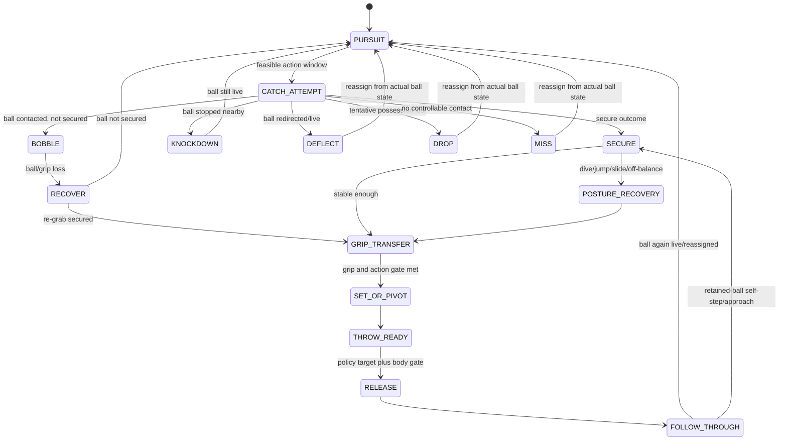

# Codex C — 捕球・送球・フットワーク状態機械の実装設計

Date: 2026-08-10
Scope: `catch / throw / footwork / animation state machine` only.  This is a research/design artifact: it does **not** modify `baseball3d.html`.
Gameplay source audited: `agent/b0805-29-possession-footwork@60b993b73fed854934a976e45e8feb9437deb584` (`b0805-29`).
Research branch: `codex/research-fielding-motion-20260810`.

## 0. Decision in one paragraph

Adopt a deterministic `FieldingExecution` state machine owned by the body-execution layer, alongside—not inside—`DefenseActionPolicy`.  It must carry the fielder's current velocity, facing, catch action, catch outcome, balance/recovery, grip security, and receipt context from the attempted catch through release.  The present code has several good local fixes (especially b28's context split and b29's stale-target stop), but it still joins a boolean-like catch result, a timer, pose-only `diveT/jumpT`, and cumulative run distance.  That cannot distinguish a clean relay from a bobbled grounder or decide whether a runner may validly throw on the run.  The v1 below preserves the current decision boundaries and replaces those disconnected controls with one observable, testable execution contract.

No large external dataset was downloaded.  In particular, no OpenBiomechanics data/archive was fetched or embedded; the task's seed already warns that its biomechanics data are CC BY-NC-SA 4.0 and unsuitable for silent commercial reuse.

## 1. Primary-source and implementation inventory

| Source actually inspected | Exact material read | What it establishes for this task | License / maintenance status checked 2026-08-10 | Game mapping |
|---|---|---|---|---|
| Current game source, `60b993b:baseball3d.html` | `transferTime` / `setTransferContext` (889-922), `moveFielders` (1668-1686), `armEff` / `throwOffset` / `launchThrow` (1719-1804), `beginThrowPhase` / `prepareThrowerFootwork` / `updateThrowPhase` (2160-2482), receive path (2485-2615), catch/deflect logic (1267-1364, 3329-3689), `fielderPose` (4351-4407) | Exact baseline and the concrete seams to replace; see §2. | Repository gameplay SHA is the prescribed canonical source. | Direct.
| [Issue #27](https://github.com/L-carp55/baseball3d-game/issues/27) | Issue body and its 2026-08-10 owner comment | Requires physical state ownership, no game-body edit, b28/b29 preservation, outcome diversity, and commit+push. | Repository issue, open; not a reusable code source. | Acceptance constraints.
| Ogura et al., [*Comparison of the kinematics of lower limb and trunk motion in baseball infielders with different skill levels while catching normal grounders and bad hops*](https://www.jstage.jst.go.jp/article/jjpehss/61/1/61_15035/_article/-char/en), 2016, DOI [10.5432/jjpehss.15035](https://doi.org/10.5432/jjpehss.15035) | Article overview/abstract: 20 infielders, two 300-Hz cameras, DLT 3-D reconstruction; time normalized from right-foot contact to catch; normal-grounder and bad-hop trials. | Higher-skill group placed the right foot earlier, had less leftward CG displacement and less posture change across normal/bad-hop catches.  It supports explicit foot-contact/balance variables and action-specific catch posture, not a universal fixed delay. | Journal article; © Japan Society of Physical Education, Health and Sport Sciences; concept-only, no code/data reuse. | `moveFielders`, ground-catch branch, `fielderPose`, recovery/plant gate.
| Miyanishi, Sakurai & Endo, [*Kinematic comparison of baseball throwing motions in relation to the trunk and throwing arm among various types of player positions*](https://www.jstage.jst.go.jp/article/jjpehss/advpub/0/advpub_14108/_article/-char/en), final 2015, DOI [10.5432/jjpehss.14108](https://doi.org/10.5432/jjpehss.14108) | Review of 20 articles; its abstract compares pitcher, catcher, and infielder release parameters and four phases: step, stride, arm cocking, acceleration. | Position groups differ in phase durations and trunk/arm timing.  A catcher, infielder, and pitcher must not inherit one generic transfer/pose curve. | © Japan Society of Physical Education, Health and Sport Sciences; concept-only. | Position/context profile selection; catcher transfer and double-play timing.
| Peng, Lo & Wang, [*Lower Extremity Muscle Activation and Kinematics of Catchers When Throwing Using Various Squatting and Throwing Postures*](https://www.jssm.org/hf.php?id=jssm-14-484.xml), *J. Sports Sci. Med.* 14 (2015), 484–493 | Full HTML: methods use eight-camera 500-Hz marker motion capture and EMG; pivot-throw and weight-shift-throw definitions; results/conclusion. | A catcher’s catch-to-throw is not a standing infielder throw: it has squat/ascend, foot-contact, acceleration, release, and follow-through phases.  Pivot and weight-shift forms use different lower-body loading, so the game needs a catcher-specific receipt-to-release profile rather than only a shorter timer. | © Journal of Sports Science and Medicine; article text, not reusable animation/data. | `catcher-throwdown` profile, `fielderPose`, first release model.
| Miyanishi & Endo, [*A Kinematic Comparison of the Delivery Motions of Catchers and Infielders in Baseball*](https://ojs.ub.uni-konstanz.de/cpa/article/view/6602), ISBS 2015 proceedings (published 2016) | Abstract and proceedings record: 13 catchers / 16 infielders, 3-D analysis, release parameters, four phase durations, pelvis/trunk/arm kinematics. | Fifteen of 45 angular position/velocity measures differed although release speed/angle did not.  Position-specific body timing is required even when the ball result looks similar. | Authors retain copyright; ISBS first-publication right. Concept-only. | Avoids a single `fielderPose` / `armEff` profile.
| [OpenSim core](https://github.com/opensim-org/opensim-core), `OpenSim/Tools/InverseKinematicsTool.cpp`, `InverseKinematicsTool::run()` (102-202) | The tool loads a model, creates marker/coordinate references, initializes state, calls `InverseKinematicsSolver::assemble`, then calls `track` at each marker frame and reports marker error. | Validates the offline pipeline distinction: fit constrained joint angles to captured markers first; export only approved compact clips/curves to a game. | Apache-2.0; active `main` pushed 2026-08-07. | Offline calibration only; never per-frame gameplay IK.
| [OpenCap core](https://github.com/stanfordnmbl/opencap-core), `utilsOpenSim.py`, `runIKTool` (164-231), `generateVisualizerJson` (611+) | Removes selected model complexity for IK, writes a setup, invokes OpenSim IK, and converts the `.mot` joint solution/model transforms to visualization JSON. | A practical path for owner-recorded reference clips: capture → marker/TRC → IK → exported transforms.  It is a content-authoring/calibration pipeline, not a fielding decision system. | Apache-2.0; active `main` pushed 2026-08-07. | Calibration-only source for representative catch, pivot, and recovery pose curves.
| [Pose2Sim](https://github.com/perfanalytics/pose2sim), `Pose2Sim/kinematics.py`, `perform_scaling` (401-485), `perform_IK` (488-554), `kinematics_all` (582+) | Scaling removes/filters unreliable frames and trims segment extremes; IK assigns the TRC file/model/time range then calls `opensim.InverseKinematicsTool.run`; output is `.mot` joint angles. | Multi-view/markerless capture can generate *new, licensed by the owner* reference motion, but crouch/occlusion is explicitly a failure mode in the code.  It cannot provide immediate reliable baseball-diving ground truth. | BSD-3-Clause; active `main` pushed 2026-07-30. | Calibration-only; do not import a full runtime dependency.
| [three.js `CCDIKSolver`](https://github.com/mrdoob/three.js/blob/dev/examples/jsm/animation/CCDIKSolver.js), `CCDIKSolver.update` / `updateOne` (35-215) | Iterates link-by-link from effector to target; converts both vectors to link-local space, clamps angle, rotates by their cross-product axis, supports joint limits and blend factor. | A small, bounded end-effector correction is feasible, but only after a skeleton exists.  It is not a locomotion state machine and should not be used to hide impossible catch reach. | MIT; active `dev` pushed 2026-08-10. | Optional v2 visual layer; v1 uses closed-form two-bone arm/glove aim because current figures are procedural pieces, not `SkinnedMesh` bones.
| [Kentops/Baseball-Game](https://github.com/Kentops/Baseball-Game), `Assets/Scripts/Base-Player Scripts/Fielder.cs` (`trackBall`, `HoldingBall`, `throwBall`) and `Fielder Throw.cs` | `trackBall` chases a stored landing point/current ball with a `NavMeshAgent`; holding ball polls input; `throwBall` assigns a ballistic Rigidbody velocity then clears `holdingBall`. | It confirms the failure pattern to avoid: `holdingBall` is a boolean, no secure/bobble/recovery state exists, and a release is not constrained by body state.  It supplies no usable catch-to-throw architecture. | GitHub API returned no detected repository license; active-looking push 2026-08-08 does not make code reusable. | Reject.

### Research limits and negative findings

1. I did **not** find a public, peer-reviewed baseball dataset that gives calibrated seconds from dive/slide/jump catch to first release, separated by outcome and player skill.  Such values must be explicitly marked *calibration-only* and fitted to owned video/recording data—not presented as sourced constants.
2. I did **not** find a primary study that turns official scoring labels directly into `bobble`, `knockdown`, `deflect`, `drop`, and `miss` probabilities.  Those labels are physical outcomes, whereas an official error is a scoring judgment.  The engine must keep those two concerns separate.
3. OpenCap/Pose2Sim/OpenSim are capable authoring tools, but their checked paths operate on recorded marker/TRC data and offline IK.  There is no evidence here for running them inside the 60-fps browser game.
4. three.js CCD IK expects a skin/skeleton.  `baseball3d.html` currently composes mesh segments in `drawFigure`; direct `CCDIKSolver` import would be an architecture rewrite, not a minimal animation fix.
5. No raw OpenBiomechanics or other large biomechanical archive was downloaded.  The source-seed estimate of roughly 411 fastball trials is irrelevant to fielding motion and its CC BY-NC-SA 4.0 restriction prevents silent game-data reuse anyway.

## 2. Exact current-code audit

| Current location | What exists now | Consequence |
|---|---|---|
| `transferTime` / `setTransferContext`, 889-922 | b28 correctly differentiates `batted-ground`, `batted-air`, `pickoff-receive`, `rundown-receive`, `relay-receive`, `throw-receive`, `double-play-pivot`, and `held-ball`. | Keep the semantic distinction, but turn it into execution profiles instead of only alternate timer formulas.
| `moveFielders`, 1668-1686 | Movement sees target, `stun`, primary/cover, acceleration and a single `running` flag.  It does not know secure/grip/plant/recovery state. | A player may only be stopped by a generic stun, rather than by a physical permission of the possession state.
| `armEff`, 1719-1727; `throwOffset`, 1734-1739 | Both use `f.run`, cumulative distance run in the play, as the throw-quality posture proxy. | Two players with the same release posture but different earlier route length get different throws; a player who has planted can stay penalized, while a fresh backwards/off-balance release can be under-penalized.
| `beginThrowPhase`, 2160-2217 | A batted-ball outcome immediately creates `stage:'transfer'`; it adds an independent `A.fumble(f.cat)` time penalty. | The failed-catch branch is not represented as a physically observable possession outcome; `fumble` can be a hidden delay instead of a bobble/drop trajectory.
| `prepareThrowerFootwork`, 2236-2249, called before `moveFielders` at 2294-2298 and again after a target update at 2327-2338 | b29 resets old target to current location, zeroes velocity, and faces target during `transfer`. | This is correct and must become an invariant of state entry.  It solves the reported stale intercept backward throw, but only for this one named stage.
| Release path, 2356-2482 | Target is re-evaluated, relays chosen, then `throwOffset` is sampled and `launchThrow` fires. | Good policy/release separation exists, but release need not prove grip security, balance, orientation, or a legal on-run throw state.
| Receive path, 2485-2615 | A receiver moves to the predicted ball; near ball it enters `stage:'catch'`, holds for `catchDur`, then may immediately relay. | Catching a throw has a context label but no receive action/outcome/footwork state.  It can become a relay without a pivot/plant profile.
| `catchProb`, `deflectBall`, 1316-1364; flight catch 3595-3648; ground catch 3650-3687 | Catch action currently reduces mostly to `routine`, `jump`, `dive`, `wait`; a miss either leaves ball live or calls `deflectBall`.  Ground errors use a single `prim.fumbled` cap and static `regrabT=+0.55`. | There is no `secure` confirmation, bobble, knockdown, drop, meaningful recovery, or first-throw effect.  `diveT`, `jumpT`, and `stun` are partly visual/timer fragments.
| `fielderPose`, 4367-4407 | Pose priority is dive → jump → throw/receive → near-ball catch → ready. | A visual priority stack, not a durable motion state; it cannot blend entry/exit, expose balance, or distinguish a relay pivot from a batted-ground throw.

## 3. Findings and game-code mapping

### F1. Catching posture, foot contact, and recovery must be state data

Ogura et al. measure the interval from right-foot contact to catch and find less skilled infielders change posture more between normal and bad-hop balls.  This supports recording `footContact`, `balance`, `facing`, and catch `action` at the attempt—not substituting a longer random transfer timer after the fact.  The source does not justify a universal number of seconds.

**Mapping:** replace the hidden `A.fumble` added in `beginThrowPhase` and fixed `regrabT` in the ground branch with an outcome that changes `FieldingExecution.recoveryUntil`, `gripQuality`, and current velocity/facing.

### F2. One ball result does not imply one motor action

The position-comparison sources show catcher and infielder timing/kinematics differ.  The catcher study additionally distinguishes pivot and weight-shift throw-downs with a catch/ascend/foot-contact/acceleration/release sequence.  Therefore, b28's observation that receiving a clean relay is not processing a batted grounder is correct, but it is incomplete: the engine needs a **profile** with entrance posture, movement permission, release gate, and follow-through—not simply a context-specific duration.

**Mapping:** retain the current `transferContext` names as inputs to `profileFor(context, role, target)`.  Add profiles for `batted-ground`, `batted-air`, `throw-receive`, `relay-receive`, `rundown-receive`, `pickoff-receive`, `double-play-pivot`, `catcher-throwdown`, `first-base-receive`, and `held-ball`.

### F3. Run, plant, and backwards release are distinct execution modes

No primary source found here licenses a universal metres-per-second cut-off.  The evidence supports a mechanics-first rule instead: foot contact and lower-body stability precede the acceleration/release phase for a set throw, while catcher pivot/weight-shift profiles use specific lower-body transition paths.  The implementation must therefore compute a **release mode** from instantaneous velocity and target-facing alignment, not from total run distance.

* `SET_FEET`: body is sufficiently settled and aimed; highest first-throw quality.
* `THROW_ON_RUN`: permitted only when movement is forward/roughly transverse to the intended target and the action profile permits it; it carries a calibrated accuracy/speed cost, but it is not forcibly frozen.
* `RECOVER_OR_PLANT`: mandatory when velocity projects materially *away* from target, after dive/jump/slide/knockdown, or when grip is not secure.  It brakes/steps/turns before release.
* `STEP` and `APPROACH`: preserve b29's exception—self-force and rundown movement are intentional possession movement, not stale pursuit.

**Mapping:** replace `armEff(f.run)` and `throwOffset(f.run)` inputs with instantaneous `releaseMode`, `facingError`, `speedAtRelease`, `gripQuality`, and `recoveryDebt`.

### F4. Catch outcome and official scoring are different layers

The physical layer should emit what happened to the ball/body.  The rules/scoring layer decides later whether a routine expected play became an error.  A difficult dive that never reaches the ball is a physical `MISS`, normally a hit; a routine catch that enters the glove then falls is `DROP`, which may be an error; a hard grounder stopped in front is `KNOCKDOWN`, not possession.  This avoids assigning an error just because a branch happened to have a random delay.

**Mapping:** `deflectBall` becomes a physics helper invoked by `resolveCatchOutcome`; it no longer also defines the entire outcome taxonomy or player recovery.

### F5. Motion capture is a calibration source, not a game-time dependency

OpenSim, OpenCap, and Pose2Sim all transform recorded markers/TRC into fitted joint transforms/angles offline.  Pose2Sim explicitly filters unreliable/crouched frames and produces `.mot`, which is useful for a future owner-shot clip library: routine grounder, forehand/backhand, pivot, relay turn, dive recovery, and catcher throw-down.  The game should import only manually approved, compressed key-pose curves plus event labels.  It must not ship non-commercial third-party data or wait on offline IK while playing.

### F6. Minimum visual system: event blending before full IK

V1 needs a state-to-pose clip table plus scalar blending (`enter`, `hold`, `exit`) and two procedural end-effector corrections:

1. glove hand aims toward a ball only after physics says the catch window is feasible; clamp its reach so visuals never create a catch; and
2. throwing forearm aims from the current shoulder toward the release direction, with elbow/shoulder limits.

Three.js's `CCDIKSolver.updateOne` is evidence that local-space, limit-clamped, blendable iterative IK is standard and MIT-licensed.  However, the current segment renderer lacks bone hierarchy, so a full CCD port is deferred.  Full body/feet IK, physics ragdolls, and motion matching are **not** v1 requirements.

## 4. Copy / adapt / concept-only / reject / calibration-only table

| Candidate | Verdict | Why and exact use |
|---|---|---|
| `FieldingExecution` state ownership beside `DefenseActionPolicy` | **adapt** | Derived from current boundaries plus issue #27.  It removes duplicated timers without allowing body animation to choose tactical targets.
| Right-foot-contact / stable-posture event for ground balls (Ogura et al.) | **concept-only** | Evidence supports the event and posture stability, not a public numerical animation curve.  Use to design state variables and calibrate from owned clips.
| Position and catcher pivot/weight-shift profiles (Miyanishi/Kang) | **concept-only** | Position-specific transitions are supported, but papers are copyrighted and do not provide a directly reusable game controller.
| Owned-video → OpenCap/Pose2Sim/OpenSim → reviewed key poses | **calibration-only** | Apache-2.0/BSD-3 code is usable under notice, but the output clip/data must be owner-created/cleared.  Offline authoring only.
| OpenSim runtime solver | **reject** | Technical/licensing code path is open, but it is an offline musculoskeletal solver, far beyond a single-file 60-fps game need.
| three.js `CCDIKSolver` local-space constraints/blend concept | **adapt** | MIT permits reuse with notice, but direct code assumes `SkinnedMesh`.  First build a two-bone procedural equivalent; reconsider direct use only after a skeleton migration.
| Kentops `Fielder.cs` / `Fielder Throw.cs` | **reject** | No detected repository license and a `holdingBall` boolean/ballistic release model repeats the very design being removed.
| Runtime RL/ML controller for possession/throw execution | **reject** | No source demonstrates that an opaque policy improves this deterministic animation contract.  It would make behavior harder to replay and mutate-test.  At most use ML later to generate adversarial offline scenarios.

## 5. Existing heuristics to delete or replace

These are replacements, not extra condition layers.

| Current heuristic | Replace with | Preserve |
|---|---|---|
| `A.fumble(f.cat)` adds a hidden 0.55–1.15 s term in `beginThrowPhase` (2200-2204) | Deterministic, seeded `resolveCatchOutcome` enters `BOBBLE`, `DROP`, `KNOCKDOWN`, `DEFLECT`, or `MISS`; only `SECURE` can begin grip transfer. | Existing scoring/result flow receives an explicit outcome rather than guessed delay.
| Ground `prim.fumbled` one-per-player cap and `ball.regrabT=ball.t+0.55` (3650-3682) | An outcome-local `recoveryDebt` and bounded retry state.  One event cannot loop forever, but re-grab timing depends on the outcome/action, not a universal 0.55. | Current non-termination guard and ball physics.
| `diveT`, `jumpT`, `stun` as separate pose/timer flags | State-owned `action`, `phaseProgress`, `landing`, `recoveryMode`; `fielderPose` reads only a pose query from the execution state. | Current visual styles can be ported as initial clip definitions.
| `armEff` and `throwOffset` use full-play `f.run` | `releaseFactors(exec)` uses current velocity vector, facing error, stance, grip, catch action/outcome, and a context profile. | Player arm/accuracy abilities and existing flight physics.
| `prepareThrowerFootwork` as a special `transfer` patch | `enterExecutionState` clears stale pursuit target/velocity whenever entering a stationary possession state. | The b29 regression invariant and its `STEP`/`APPROACH` exceptions.
| `transferTime(context)` as the sole semantic effect of context | `executionProfile(context, position, desiredAction)` returns a release gate, pose clip, permitted movement and calibrated duration distribution. | The b28 taxonomy and its fast receive vs slow batted-ground principle.
| Pose priority if-chain in `fielderPose` | `sampleExecutionPose(exec, now)` blends base locomotion with one action clip and small glove/throw aim correction. | Procedural single-file renderer; no new renderer required for v1.

## 6. Proposed target architecture

### 6.1 Ownership contract

```text
FieldingAssignment / ReachModel
    owns: who pursues, reachable catch window, field roles and movement target

DefenseActionPolicy / ThrowDecision
    owns: desired tactical action and desired throw target, re-evaluated from legal visible state

FieldingExecution (new)
    owns: whether a fielder can catch, secure, recover, plant, transfer, release, or intentionally move now
    emits: possession state, release readiness, execution ETA/quality envelope, observable outcome

PlayLifecycle / rules / scoring
    owns: live/dead play, outs, legal base touch/tag, and whether an observed physical outcome is an error
```

`DefenseActionPolicy` may request `throwTo: 1`; it may not set `ball.vx`, zero the fielder velocity, or declare a catch.  `FieldingExecution` may refuse/defer release because the body is unready; it may not retarget a runner for strategic reasons.  At release time it asks the existing `decideThrowTarget` once more, exactly as b29 already does, then freezes the physical release snapshot.

### 6.2 Data owned per fielder

```js
// one object per fielder; all fields replay/recording serializable
f.exec = {
  state: 'PURSUIT',             // §7 names
  enteredAt: 0,
  profile: 'batted-ground',
  action: 'routine-ground',     // catch/movement action, never a tactical target
  outcome: null,                // null | secure | bobble | knockdown | deflect | drop | miss
  possession: 'none',           // none | tentative | secure
  gripQuality: 0,               // 0..1; must reach profile.releaseGrip
  recoveryDebt: 0,              // seconds remaining, calibrated
  foot: { contact: 'none', plant: 0 },
  kin: { vx: 0, vy: 0, facing: 0, facingError: 0 },
  targetSnapshot: null,         // only while release is physically committed
  releaseMode: null,            // set-feet | on-run | recover-or-plant | pivot
  movement: 'assignment',       // assignment | brake | plant | self-step | rundown-approach | none
  visual: { clip: 'ready', u: 0, blendIn: 0, blendOut: 0 }
};
```

The world movement vector remains on `f` for minimum disruption, but `exec.kin` must be copied from it each simulation tick before a catch/release decision.  Do not use cumulative `f.run` to infer current posture.

### 6.3 Profiles avoid a giant scenario tree

Profiles are data, selected by `transferContext` plus position/role.  They contain thresholds and allowed action sets; they do not contain tactical `if runner ...` rules.

```js
const EXEC_PROFILE = {
  'batted-ground':    { allow: ['set-feet','on-run'], needsPlantForBackwards: true, releaseGrip: 0.88 },
  'batted-air':       { allow: ['set-feet','on-run'], recoveryFor: ['jump','dive'], releaseGrip: 0.86 },
  'throw-receive':    { allow: ['set-feet','on-run'], releaseGrip: 0.76 },
  'relay-receive':    { allow: ['pivot','on-run'], releaseGrip: 0.72 },
  'rundown-receive':  { allow: ['on-run','set-feet'], releaseGrip: 0.70 },
  'pickoff-receive':  { allow: ['pivot','set-feet'], releaseGrip: 0.72 },
  'double-play-pivot':{ allow: ['pivot'], releaseGrip: 0.68 },
  'catcher-throwdown':{ allow: ['pivot','weight-shift'], releaseGrip: 0.80 },
  'first-base-receive': { allow: ['base-stretch','set-feet'], releaseGrip: 0.78 },
  'held-ball':        { allow: ['set-feet','self-step','rundown-approach'], releaseGrip: 0.72 }
};
```

The numerical values above are deliberately placeholders, not biomechanics claims.  V1 must expose them in one config block and fit them to owned recordings/acceptance playtests.

## 7. State-transition diagram and transition table



| State | Entry condition / ball ownership | Movement permission | Exit guard |
|---|---|---|---|
| `PURSUIT` | no possession; assignment target exists | assignment locomotion | physical catch window opens.
| `CATCH_ATTEMPT` | a specific action and current ball snapshot are feasible | only action-specific final step; no target replan except cancelled window | seeded physical outcome; never declares a catch merely from range.
| `SECURE` | ball is controlled, velocity stopped/attached | profile-defined brake; no old pursuit target | direct to grip if balanced, otherwise recovery.
| `BOBBLE` | contact but insufficient grip; ball stays controllably local | no release; limited reach/re-grab | secure re-grab or actual ball remains live.
| `KNOCKDOWN` | ball stopped/near but never secured | recovery/short reacquire only | reassign using actual ball position; no throwing.
| `DEFLECT` / `DROP` / `MISS` | ball live with respectively redirected/lost/no contact | none until assignment re-evaluates; contact fielder may have recovery debt | `PURSUIT` via `setPrimaryFielder` only.
| `POSTURE_RECOVERY` | secure ball after dive/jump/slide or unbalanced catch | brake/roll/rise only; **not** old pursuit | recovery debt reaches zero and grip can progress.
| `GRIP_TRANSFER` | secure ball; no required recovery remains | pivot/plant only per profile; target may tactically update | grip threshold plus release-mode classification.
| `SET_OR_PIVOT` | transfer complete | set-feet brake, double-play pivot, catcher pivot/weight shift, or permitted on-run step | legal facing/foot contact and action completion.
| `THROW_READY` | target decision available and body has legal release mode | no stale pursuit; a deliberately moving on-run mode is allowed | release snapshot accepted this tick.
| `RELEASE` | ball detaches and `launchThrow` uses one snapshot | no tactical update during this instantaneous action | enters follow-through.
| `FOLLOW_THROUGH` | after ball release | short clip/locomotion recovery; no imaginary immediate rethrow | next assignment or retained-ball action.
| `SELF_STEP` / `RUNDOWN_APPROACH` | existing `step` / `approach` possession cases | explicitly move toward base/runner | base/tag/rundown transition; never treated as stale pursuit.

## 8. Ability inputs and movement permissions

| Input | Read where | Must not be used as |
|---|---|---|
| `cat` (fielding/catch skill) | outcome distribution, grip acquisition, routine receive security | a hidden generic delay after a catch.
| `fld` / reaction | pursuit/catch-window feasibility, action reach, recovery capability | a penalty applied to clean relay receipt just because it was a batted ground profile previously.
| `acc` (throw accuracy) | baseline release dispersion, modified by instantaneous release factors | a substitute for pose, grip, or facing error.
| `arm` | baseline achievable release speed and reach | a guarantee that an unbalanced backward throw has normal speed.
| velocity vector / speed | release-mode classification, brake/plant duration, pose blend | cumulative `f.run` from an earlier route.
| velocity projection onto target direction | backward/off-balance guard | a policy scoring input.
| facing error / foot-contact / stance | plant readiness and first-throw quality | cosmetic-only pose values.
| catch action/outcome and context profile | recovery debt, allowed release modes, clip choice | an official-error label.

### Movement rule that protects b29

On entry to any stationary possession state (`SECURE`, `GRIP_TRANSFER`, `SET_OR_PIVOT`, `THROW_READY` in `set-feet` mode), execute the generalized b29 action before `moveFielders`:

```js
clearPursuitTarget(f); // target = current position; target/route velocity cannot survive
f.v = 0;
faceExecutionTarget(f, desiredTarget);
```

`SELF_STEP`, `RUNDOWN_APPROACH`, and deliberate `THROW_ON_RUN` are explicit exceptions whose `movement` field is not `none`.  This is a general state invariant, not a special condition for the recorded second-baseman case.

## 9. Catch action and error-branch table

| Action type | Eligibility and pose intent | Success outcomes | Failure outcomes | Recovery/release implication |
|---|---|---|---|---|
| Routine ground / chest-high routine | stable window, ordinary reach | `SECURE`; rare `BOBBLE` or `DROP` | `DEFLECT` only on actual contact; `MISS` otherwise | fastest batted-ground transfer after a plant; routine `DROP` can be scoring-error eligible.
| Forehand / backhand / short-hop | side-specific glove target, elevated orientation and balance difficulty | secure or bobble | knockdown/deflect/miss | retain lateral momentum and facing error; do not snap to square stance.
| Running catch | catch while locomotion persists | secure with on-run candidate | bobble/deflect/miss | only forward/lateral run-and-throw profile can release; backwards component forces plant/recovery.
| Jump | vertical reach feasible and velocity low enough | secure or bobble on landing | deflect/miss | landing then `POSTURE_RECOVERY`; first throw cannot use a standing-ready pose instantly.
| Dive / slide | horizontal deficit feasible; action commits body to ground | secure, bobble, knockdown | deflect/miss | state owns roll/rise debt; no throw until post-landing recovery and grip gate.
| Wall-adjacent | wall clearance/contact must be physically valid | secure/bobble | knockdown/deflect/miss | profile can add orientation/recovery; current wall physics remains separate.
| Clean throw receive | receiver intersects actual throw at valid height | secure, rare bobble/drop | miss/deflect | uses `throw-receive`, `relay-receive`, etc.; not batted-ground fielding delay.
| Double-play pivot receive | base/force position, legal catch window | secure/pivot | bobble/drop | short pivot release profile; if no secure ball, no imaginary relay.
| First-base receive / stretch | receiver can keep/return foot to base while receiving | secure | stretch miss/deflect | base-touch legality remains in rule layer; body profile owns stretch and recovery.
| Catcher throw-down | squat receipt, ascend, pivot or weight shift | secure/pivot | bobble/drop | special profile for rise/foot contact/arm cocking, not generic infielder transfer.

### Outcome attribution

`resolveCatchOutcome` should sample from a reproducible categorical distribution conditioned on physical difficulty and ability.  It should return `{ outcome, contacted, possession, ballImpulse, recoveryClass }`.  The scoring layer receives that record plus routine-expectation information and decides `S.errorBy`; it must not infer an error merely because `outcome !== secure`.

For v1, record every distribution input, selected outcome, and random seed in the existing recording stream.  This lets the owner reproduce the same bobble rather than chasing an unrecorded random branch.

## 10. First-throw accuracy, speed, and recovery model

### 10.1 Release-mode decision

At `THROW_READY`, compute the target direction `u`, horizontal velocity `v`, speed `s = |v|`, and `toward = dot(v,u)/max(s,epsilon)`.

```text
if possession != secure or gripQuality < profile.releaseGrip: remain/re-enter GRIP_TRANSFER
else if recoveryDebt > 0: POSTURE_RECOVERY
else if toward < backwardsThreshold: RECOVER_OR_PLANT
else if profile allows pivot and pivotFoot/contact criteria hold: PIVOT
else if profile allows on-run and s is in calibrated run window: THROW_ON_RUN
else: SET_FEET
```

The thresholds are calibration parameters; tests enforce ordering rather than pretend the literature supplied one exact cut-off.  In particular, `toward < backwardsThreshold` must never pass into a normal release.  This directly prevents the b29 backwards-while-throwing class even if a target was retargeted late.

### 10.2 Quality envelope

Compute one snapshot at release, not an accumulated route penalty:

```text
speedMultiplier = profile.baseSpeed
                × postureSpeed(releaseMode, facingError, recoveryClass)
                × gripSpeed(gripQuality)

sigma = distance × [accuracyBase(acc)
                    + postureSpread(releaseMode, facingError)
                    + gripSpread(gripQuality)
                    + recoverySpread(recoveryClass)]
```

`arm` determines baseline `throwSpeed`; `acc` determines `accuracyBase`; `posture`/`grip`/recovery are multiplicative/additive modifiers to their own channels.  Do not let a long completed run permanently alter the next throw after the fielder has planted.  A successful dive/jump still carries a first-throw penalty through `recoveryClass` and `gripQuality`, but not an invented extra error after the throw has completed.

### 10.3 Initial calibration policy

* Calibrate profile timing/penalty ranges from owned video or recording comparisons, marked with source and confidence.
* Validate monotonic order before tuning values: clean relay faster/better than batted ground; clean routine better than bobble; set-feet better than off-balance; permitted on-run better than a forced backward release; dive recovery slower than routine.
* Keep seeded randomness at one well-defined outcome/release point.  Do not add per-frame random error checks.

## 11. Minimal implementation v1 (concrete, but not implemented in this research phase)

### 11.1 New functions/data

1. `ensureFieldingExecution(f)` — initializes `f.exec` only at reset/first use.
2. `executionProfileFor(context, f, intent)` — data lookup from existing b28 context plus position/role.
3. `enterFieldingExecution(f, next, data)` — the only state writer; records event/seed and runs the generalized stale-target guard when movement becomes stationary.
4. `requestCatchAttempt(f, action, ballSnapshot, profile)` — called from existing catch-window branches; creates `CATCH_ATTEMPT` instead of immediately mutating ball/pose fields.
5. `resolveCatchOutcome(f, snapshot, rng)` — one categorical physical outcome; calls ball physics only after choosing outcome.
6. `updateFieldingExecution(f, dt, decision)` — advances recovery, grip, plant/pivot, and release gate.  It returns `{canRelease, movementMode, quality}`; it never returns a tactical base.
7. `classifyReleaseMode(exec, targetPoint)` and `releaseFactors(exec, targetPoint)` — replace route-distance-based `armEff` and `throwOffset` modifiers.
8. `sampleExecutionPose(f, now)` — replaces direct pose priority in `fielderPose`; initially reuses current ready/dive/jump/throw poses as clips.
9. `recordFieldingExecutionEvent(f, event)` — compact diagnostic fields: `es`, `ea`, `eo`, `ep`, `eg`, `er`, `em`, `ef`, `evx`, `evy`, `eseed`.

### 11.2 Call-site conversion plan

* In `stepFlight`, retain `planCatchAction` only as action-window generation.  Call `requestCatchAttempt`; after outcome, call `setPrimaryFielder` / `deflectBall` only for actual live-ball outcomes.
* In `beginThrowPhase`, replace direct `stage:'transfer'` creation and hidden fumble timer with a secure-possession execution entry; keep the current decision metadata.
* In `updateThrowPhase`, call `updateFieldingExecution` before `moveFielders`.  Map `SELF_STEP` and `RUNDOWN_APPROACH` to existing `step`/`approach`, but map stationary transfer to no movement.  Keep release-time `decideThrowTarget`.
* In the throw-receive block, enter `CATCH_ATTEMPT` with a receive profile, then transfer/release only after `SECURE` and a profile gate.
* Change `armEff` / `throwOffset` signatures to accept a release snapshot.  Keep `throwSpeed`, `throwAngle`, and `launchThrow` physics unchanged in v1.
* Replace `fielderPose` with `sampleExecutionPose`; leave `drawFigure` and mesh construction unchanged.

### 11.3 Explicit non-goals for v1

No raw mocap import, full-body skeleton migration, OpenSim runtime, ragdoll, motion matching, learning policy, ball-physics rewrite, runner-control change, or force-chain policy rewrite.  Those all exceed the narrow catch/throw/footwork contract.

## 12. Direct behavioral contract tests

All probability tests use fixed seeds and inspect recorded execution events; animation timing must not be inferred from screenshots alone.

| Contract | Fixture and expected behavior |
|---|---|
| Stale-target possession | Reproduce b29 start/old intercept target.  Enter stationary `GRIP_TRANSFER`; before `moveFielders`, target equals current position and velocity is zero.  Remove the entry guard and require failure.
| Intentional possession movement | Existing self-force `step` and rundown `approach` fixtures retain movement toward base/runner; state guard must not freeze them.
| Context separation | Same ability/geometry: `batted-ground` takes longer to legal release than clean `relay-receive`; clean pickoff/rundown remains separate; context must be recorded.
| Backwards-throw rejection | Give a secure fielder velocity projected away from release target.  It enters `RECOVER_OR_PLANT`, releases no ball until projection/footing is legal, and never launches at old target.
| Permitted run-and-throw | Forward/lateral eligible running catch may release in `THROW_ON_RUN`; it is slower/less accurate than `SET_FEET` under the same arm/accuracy but not forcibly frozen.
| Dive/jump/slide recovery | Same fielder/target: secure dive/jump/slide has nonzero recovery debt and a worse first-release envelope than routine; no release occurs during recovery.
| Secure versus bobble | A bobble records `possession:'tentative'`, cannot call `launchThrow`, then either re-grabs after grip/recovery or leaves ball live.  Secure catch has no invented bobble delay.
| Outcome/scoring separation | Routine drop can be error eligible; impossible dive miss is not automatically charged an error.  Rule-layer scoring result is asserted separately from physical outcome.
| Double-play pivot | Clean `double-play-pivot` receive may pivot-rethrow only after secure transfer; collapse it to batted-ground and require regression failure on timing/clip/context.
| Catcher and first base | Catcher throw-down uses `catcher-throwdown` rise/pivot profile; first-base receive verifies body can complete receive/base-touch posture without borrowing catcher/grounder timing.
| Release snapshot | Target changing during transfer updates facing before release; once `RELEASE` starts, `launchThrow` uses one recorded target/quality snapshot and no later target mutation changes its flight.
| Visual truth | Glove end-effector correction remains within permitted reach.  Disable the reach clamp and require a test failure for an otherwise visually vacuumed catch.

## 13. Mutation tests

| Mutation | Required detection |
|---|---|
| Delete stationary-possession `clearPursuitTarget` / velocity reset | b29 stale-target test detects backwards movement before throw.
| Treat all possession states as stationary | `step` and `approach` contract fails.
| Collapse every profile to `batted-ground` | relay/pickoff/rundown/double-pivot timing profile test fails.
| Set `recoveryDebt=0` after dive/jump/slide | difficult-catch first-release test fails.
| Mark `BOBBLE` as `secure` | no-release-before-secure and outcome/scoring separation tests fail.
| Replace instantaneous release factors with `f.run` | planted-after-long-route vs fresh-backwards-release comparison fails.
| Permit negative target-velocity projection to release | backwards-throw rejection fails.
| Move `prepare` after `moveFielders` | one-frame stale motion test fails.
| Let `sampleExecutionPose` extend glove beyond physical catch radius | visual-truth clamp test fails.
| Re-evaluate release target after snapshot/launch | release-snapshot flight fixture fails.

## 14. Impact on existing validation

Implementation must add a dedicated deterministic execution suite before changing shared game behavior.  It must then rerun, without cherry-picking only favorable cases:

1. the b29 recording regression and its mutation,
2. existing RunnerIntent / FieldingAssignment / ReachModel / DefenseActionPolicy / force-chain tests,
3. b28 transfer-context and breakaway tests,
4. the full 138-recording corpus (report exact pass/fail and changed event fields; do not claim a historical PASS as a new run),
5. the 1,000-route suite, extended with outcome/state-transition counts and no nontermination, and
6. 50 full games, adding distributions for catch type/outcome, recovery-to-release time, on-run versus set-feet release, throw error magnitude, and context profile.

The existing 1,000-route metric alone cannot prove visual/motor correctness.  Owner playtest must specifically inspect: routine grounder, forehand/backhand, clean relay, double-play pivot, jump, dive, bobble recovery, catcher throw-down, and the original b29 re-catch situation.

## 15. Licensing and commercial-use constraints

* **Game source:** do not copy external gameplay code into this research change.
* **OpenSim/OpenCap:** Apache-2.0 code; **Pose2Sim:** BSD-3-Clause; both require retaining applicable notices if code is reused.  Their output is not automatically a license for third-party recorded motion.
* **three.js CCDIKSolver:** MIT; retain copyright/license if directly copied.  Current recommendation is design adaptation, not a source import.
* **Biomechanics papers/proceedings:** use findings as concepts/citations; do not copy figures, tables, recordings, or text into a commercial asset pipeline.
* **Kentops:** no detected repository license in GitHub API at inspection, so do not copy code/assets.
* **OpenBiomechanics:** code may be MIT per task seed, but its data/docs are CC BY-NC-SA 4.0 with additional exclusions; no raw data is to be embedded in a potentially commercial game without separate permission.

## 16. Risks, unresolved questions, and failure modes to avoid

1. **Calibration risk:** recovery and error constants lack a suitable open baseball dataset.  Start with ordering tests and owned-video calibration; label all numbers provisional.
2. **Taxonomy risk:** too many outcomes can become cosmetic labels.  Every outcome must affect ball possession/physics, recovery, or first throw and be visible in records.
3. **Probability risk:** arbitrary per-frame random checks create irreproducible results.  Sample once per attempt with a seed, then simulate the selected physical result.
4. **Architecture risk:** do not let a new `FieldingExecution` write tactical targets or let `DefenseActionPolicy` force body state.  That would rebuild the prohibited giant scenario tree.
5. **Animation risk:** pose blending cannot make a physically impossible catch valid.  Collision/reach remains authoritative and IK must be clamped.
6. **Role-specialization risk:** profile selection must be data driven by context/position rather than dozens of runner-specific branches.  Add a new profile only with a distinct physical entrance/release contract.
7. **Testing risk:** passed route/game counts can hide pose mistakes.  Preserve frame-level state diagnostics and require owner visual confirmation.

## 17. Explicit hypothesis verdicts

* **H3 — confirm, refined.** Catch possession must be a multi-state process, but the meaningful boundary is not only `caught/not caught`: it is a physical outcome plus secure-grip/recovery/release readiness, with scoring separate.
* **H4 — confirm, strengthened.** Tactical decision and body execution must remain separate.  The new body layer reports a feasible execution envelope; it does not select base targets.  b28's context separation and b29's stale-target invariant become profile/state contracts.
* **H5 — confirm for this scope.** ML/RL has no role in the runtime possession state machine.  A later offline generator may search for transition/race-condition fixtures, but deterministic seeded execution is required for replay, mutation tests, and owner trust.

## 18. Recommended implementation order after integrated design approval

1. Add serializable `FieldingExecution`, event diagnostics, and generalized stale-target guard without changing probabilities.
2. Route existing secure catches and b28 contexts through profiles; preserve current ball flight and tactical policies.
3. Replace `f.run` release penalties with release snapshot factors and add backward/on-run/plant contracts.
4. Replace hidden fumble/static regrab with seeded outcome branches; calibrate outcome/recovery ordering.
5. Migrate `fielderPose` to clip/blend query, then add limited glove/throw two-bone correction.
6. Only after v1 behavior is stable, author owned reference clips through the offline mocap path and consider skeleton/CCD IK migration.

This order removes the known failure classes first while keeping the research phase read-only and preserving the existing shared decision architecture.
